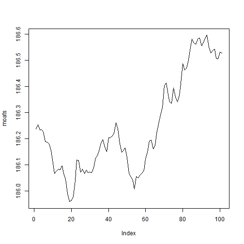
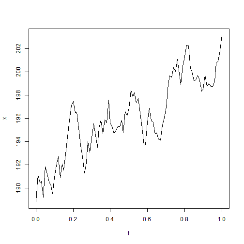
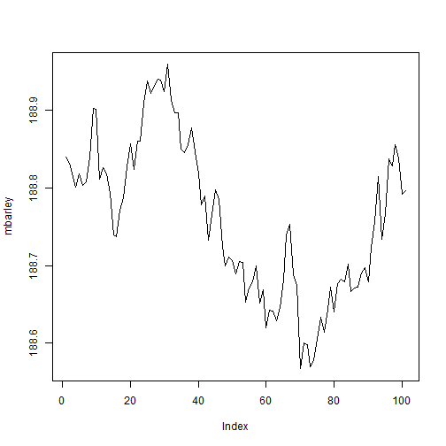

Ornstein Uhlenbeck/Vasicek Model of Crop Prices in Alberta 
========================================================


## 1 Introduction

We use the historic data to estimate the parameters for Ornstein Uhlenbeck process of crop prices in Alberta. And then we use the estimated parameters for Monte Carlo simulation.

## 2 Calibrating Ornstein Uhlenbeck Model

### 2.1 Method

The Ornstein-Uhlenbeck or Vasicek process is   a stochastic process which is stationary, Gaussian, and Markovian. 

Over time, the process tends to drift towards its long-term mean: such a process is called mean-reverting.

The Ornstein-Uhlenbeck or Vasicek process is the unique solution to the following stochastic differential equation:(Stochastic Differential Equation, 2008, p44.)

Ornstein-Uhlenbeck model
$$dX_t =  - \theta_2 X_t dt +\theta_3dW_t,    $$

Vasicek modified it to 

$$dX_t = (\theta_1 - \theta_2X_t)dt +\theta_3dW_t,    X_0 = x_0$$

$(\theta_1 - \theta_2X_t)dt$ is **deterministic part**; $\theta_3dW_t$ is **stochastic part**.


$dW_t$ is the Brownian motion, which follows random normal distributioin $N(0,t)$.

$(\theta_1 - \theta_2X_t)$ is **drift**; $\theta_3$ is **diffusion**.


In finance, the model more often is written as:

$$ dS_t = \theta(\mu - S_t)dt + \sigma dW_t$$


where  $\sigma$ is interpreted as the  instantaneous volatility ,   $\sigma^2/(2\theta)$ is the long term variance;  $\mu$ is the long-run equilibrium value of the process, and $\theta$ is the speed of reversion.

$\theta$ increases the speed at which the system stabilizes around the long term mean $\mu$.

$\sigma$ increases the amount of  randomness entering the system.


"The Ornstein-Uhlenbeck process is one of several approaches used to model (with modifications) interest rates, currency exchange rates, and commodity prices stochastically. The parameter $\mu$ represents the equilibrium or mean value supported by fundamentals; $\sigma$ the degree of volatility around it caused by shocks, and $\theta$ the rate by which these shocks dissipate and the variable reverts towards the mean."(Wikipedia)


For $\theta_2>0$,  $X_t~$ are assumed iid $$N(\frac{\theta_1}{\theta_2},\frac{\theta_3^{2}}{2\theta_2})$$.

$$\frac{\theta_1}{\theta_2} = \mu   ~~\mbox{and}~~ \theta_2 = \theta ~~\mbox{and}~~ \theta_3 = \sigma$$.

For any $t>=0$, the density of the distribution of $X_t$ given $X_0 = x_0$, with mean and variance respectively:

$$m(t,x) = E_\theta(X_t ~|~ X_0 = x_0) = \frac{\theta_1}{\theta_2} + (x_0-\frac{\theta_1}{\theta_2})e^{-\theta_2t}$$

and

$$v(t,x) = Var_\theta(X_t ~|~ X_0 = x_0) =\frac{\theta_3^2 (1- e^{-2 \theta_2 t} )}{2 \theta_2}  $$


### 2.1.0 Data processing

We got monthly price data of crops in Alberta from **Statistics Canada**[http://www5.statcan.gc.ca/subject-sujet/result-resultat?pid=920&id=2024&lang=eng&type=ARRAY&sortType=3&pageNum=0](http://www5.statcan.gc.ca/subject-sujet/result-resultat?pid=920&id=2024&lang=eng&type=ARRAY&sortType=3&pageNum=0).

In excel, we transform the date format to month/day/year, which save some time.


```r
setwd("E:/Dropbox/book/economics/485/projects/pricemodel/oumodel")

crop.price <- read.csv("abcropprice.csv", header = T, sep = ",")
# set the date format
crop.price[, 1] <- as.Date(crop.price[, 1], format = "%d/%m/%Y")

head(crop.price)
```

```
##         Date Wheat.excluding.durum  Oats Barley Canola Dry.peas
## 1 1985-01-01                 166.0 114.6  127.4  342.0       NA
## 2 1985-02-01                 167.2 116.2  127.4  347.3       NA
## 3 1985-03-01                 166.9 118.4  130.3  350.0       NA
## 4 1985-04-01                 164.8 115.7  127.4  363.8       NA
## 5 1985-05-01                 166.8 105.7  125.6  354.6       NA
## 6 1985-06-01                 166.6 102.2  121.4  349.6       NA
```


For the Ornstein Uhlenbeck Model, long term data has more breaks or jumps, so we only use the short term data which is from stable period and capture the current characteristics of the stochastic process. We decide to use the data after 2007.


```r
price <- crop.price[crop.price$Date > "2006-12-01", ]
head(price)
```

```
##           Date Wheat.excluding.durum  Oats Barley Canola Dry.peas
## 265 2007-01-01                 169.9 149.0  134.5  339.1      181
## 266 2007-02-01                 170.7 152.6  142.7  350.1      189
## 267 2007-03-01                 174.5 163.4  144.8  353.0      205
## 268 2007-04-01                 167.2 165.3  147.2  354.0      230
## 269 2007-05-01                 165.2 165.3  154.4  362.6      239
## 270 2007-06-01                 167.4 167.4  160.8  370.8      249
```


### 2.2  Calibration using Maximum Likelihood estimates

There are many ways to calculate the parameters. 

#### 2.2.2 Function "ouFit.ML"


Second, we manually use the function from "Calibrating the Ornstein-Uhlenbeck (Vasicek) model"[http://www.sitmo.com/article/calibrating-the-ornstein-uhlenbeck-model/](http://www.sitmo.com/article/calibrating-the-ornstein-uhlenbeck-model/)

Function "ouFit.ML" is saved in file "oufit.R".


```r
# function for Calibration using Maximum Likelihood estimates
ouFit.ML = function(spread) {
    n = length(spread)
    delta = 1  # delta 
    Sx = sum(spread[1:n - 1])
    Sy = sum(spread[2:n])
    Sxx = sum((spread[1:n - 1])^2)
    Syy = sum((spread[2:n])^2)
    Sxy = sum((spread[1:n - 1]) * (spread[2:n]))
    mu = (Sy * Sxx - Sx * Sxy)/((n - 1) * (Sxx - Sxy) - (Sx^2 - Sx * Sy))
    theta = -log((Sxy - mu * Sx - mu * Sy + (n - 1) * mu^2)/(Sxx - 2 * mu * 
        Sx + (n - 1) * mu^2))/delta
    a = exp(-theta * delta)
    sigmah2 = (Syy - 2 * a * Sxy + a^2 * Sxx - 2 * mu * (1 - a) * (Sy - a * 
        Sx) + (n - 1) * mu^2 * (1 - a)^2)/(n - 1)
    sigma = sqrt((sigmah2) * 2 * theta/(1 - a^2))
    theta = list(theta = theta, mu = mu, sigma = sigma, sigmah2 = sigmah2)
    return(theta)
}
```


##### 2.2.2.1 Calculate the parameters for wheat


```r
# source('oufit.R') # not necessary

wheat <- as.vector(price[, 2])  # convert to vector 
head(wheat)
```

```
## [1] 169.9 170.7 174.5 167.2 165.2 167.4
```

```r
# plot(wheat, type = 'l')
ouFit.ML(wheat)
```

```
## $theta
## [1] 0.1198
## 
## $mu
## [1] 249.9
## 
## $sigma
## [1] 21.99
## 
## $sigmah2
## [1] 430.1
```

```r
paraWheat <- c(ouFit.ML(wheat)[[1]], ouFit.ML(wheat)[[2]], ouFit.ML(wheat)[[3]])
```


##### 2.2.2.2 Calculate the parameters for oats

```r
oats <- as.vector(na.omit(price[, 3]))  # get rid of n/a and convert to vector 
head(oats)
```

```
## [1] 149.0 152.6 163.4 165.3 165.3 167.4
```

```r
# plot(oats, type = 'l')
ouFit.ML(oats)
```

```
## $theta
## [1] 0.08256
## 
## $mu
## [1] 186.2
## 
## $sigma
## [1] 9.471
## 
## $sigmah2
## [1] 82.68
```

```r
paraOats <- c(ouFit.ML(oats)[[1]], ouFit.ML(oats)[[2]], ouFit.ML(oats)[[3]])
```


##### 2.2.2.3 Calculate the parameters for barley

```r
barley <- as.vector(na.omit(price[, 4]))  # get rid of n/a and convert to vector 
head(barley)
```

```
## [1] 134.5 142.7 144.8 147.2 154.4 160.8
```

```r
# plot(barley, type = 'l')
ouFit.ML(barley)
```

```
## $theta
## [1] 0.04971
## 
## $mu
## [1] 188.8
## 
## $sigma
## [1] 11.29
## 
## $sigmah2
## [1] 121.3
```

```r
paraBarley <- c(ouFit.ML(barley)[[1]], ouFit.ML(barley)[[2]], ouFit.ML(barley)[[3]])
```


##### 2.2.2.4 Calculate the parameters for canola

```r
canola <- as.vector(na.omit(price[, 5]))  # get rid of n/a and convert to vector 
head(canola)
```

```
## [1] 339.1 350.1 353.0 354.0 362.6 370.8
```

```r
# plot(canola, type = 'l')
ouFit.ML(canola)
```

```
## $theta
## [1] 0.04689
## 
## $mu
## [1] 507.7
## 
## $sigma
## [1] 18.46
## 
## $sigmah2
## [1] 325.5
```

```r
paraCanola <- c(ouFit.ML(canola)[[1]], ouFit.ML(canola)[[2]], ouFit.ML(canola)[[3]])
```


##### 2.2.2.5 Calculate the parameters for Dry peas

```r
dry.peas <- as.vector(na.omit(price[, 6]))  # get rid of n/a and convert to vector 
head(dry.peas)
```

```
## [1] 181 189 205 230 239 249
```

```r
# plot(dry.peas, type = 'l')
ouFit.ML(dry.peas)
```

```
## $theta
## [1] 0.05435
## 
## $mu
## [1] 279.5
## 
## $sigma
## [1] 14.08
## 
## $sigmah2
## [1] 187.7
```

```r
paraDrypeas <- c(ouFit.ML(dry.peas)[[1]], ouFit.ML(dry.peas)[[2]], ouFit.ML(dry.peas)[[3]])
```


##### 2.2.2.6 All the parameters estimates


```r
para <- data.frame(rbind(paraWheat, paraOats, paraBarley, paraCanola, paraDrypeas))
rownames(para) <- c("Wheat", "Oats", "Barley", "Canola", "Drypeas")
colnames(para) <- c("Theta", "Mu", "Delta")
para
```

```
##           Theta    Mu  Delta
## Wheat   0.11982 249.9 21.993
## Oats    0.08256 186.2  9.471
## Barley  0.04971 188.8 11.290
## Canola  0.04689 507.7 18.465
## Drypeas 0.05435 279.5 14.076
```


##### 2.2.2.7 The price graphs for crops


```r
plot(wheat, type = "l", lwd = 2.5, ylim = c(120, 650), xlab = "Crop prices", 
    col = 1)
lines(oats, type = "l", lwd = 2.5, col = 2)
lines(barley, type = "l", lwd = 2.5, col = 3)
lines(canola, type = "l", lwd = 2.5, col = 4)
lines(dry.peas, type = "l", lwd = 2.5, col = 5)
legend("topleft", c("wheat", "oats", "barley", "canola", "dry.peas"), lty = c(1, 
    1), lwd = c(2.5, 2.5), col = c(1, 2, 3, 4, 5))
```

 


## 3 Generate the price vectors/matrices by simulation

There are two packages we can use to generate Vasicek process.


The following simulation equation can be used for generating paths (sampled with fixed time steps of $\delta$). The equation is an exact solution of the SDE.
$$S_{i+1} = S_i e^{-\theta \delta} + \mu (1- e^{-\theta \delta}) + \delta \sqrt(\frac{1- e^{-2 \theta \delta}}{2 \theta}) N_{0,1}$$


### 3.3 Function 

#### 3.3.1

```{}
# Brownian motion
# Example from Dixit and Pindyck, 1994, pp.74-76
# Simple mean-reverting process:% dx = nu (xbar - x) dt + sigma dz
# 
OU.sim <- function(para = c(0.01, 200, 1), x0= 1, periods=100){
        periods=100; #Number of periods
nu = c(0.0, 0.01, 0.02, 0.5); # speed of reversion
sigma = ouFit.ML(wheat)[[2]]; # in monthly terms
ones = c(1,1,1,1) # all one vector
sigma2 = (((sigma^2)*(2*nu)).*(ones-exp(-2*nu))).*0.5; #dt=1;
xbar=c(1, 1, 1, 1); # Level to which x tends to revert, or normal level
x=matrix(rep(0, periods*4), periods, 4) # all zero, 100*4 matrix
epsilon=matrix(rnorm(periods*4),periods,4); # random normal number, 100*4 matrix
x[1,]=c(1,1,1,1); # Starting value of first row of x 
i=2;

for 
while i<periods+1
#    x(i, :)=x(i-1, :)+nu.*(xbar-x(i-1, :)) + sigma*epsilon(i-1, :);
    x(i, :) = x(i-1, :) + xbar.*(ones(1,4)-exp(-nu)) + x(i-1, :).* ...
       (exp(-nu)-ones(1,4)) + sigma*epsilon(i-1, :);
    i=i+1;
end;

#figure (1)
#plot(x);
#xlabel('Period');
#ylabel('Value of x');
#title('Ornstein-Uhlenbeck Stochastic Mean-Reversion Process');
#legend('0.00', '0.01', '0.02','0.50'); 
    
        
        
}


```
Graph


### 3.1 "yuima" packages

The simulation follows the method mentioned on "1 4 Vasicek Model "[https://www.youtube.com/watch?v=5BpOYPNxWsA&index=4&list=PLRj8HuwfWZEsXW2pzAwAWYC8EZbD2ieOq](https://www.youtube.com/watch?v=5BpOYPNxWsA&index=4&list=PLRj8HuwfWZEsXW2pzAwAWYC8EZbD2ieOq)

Recall "yuima" package uses this notation:

$$ dS_t = \theta(\mu - S_t)dt + \sigma dW_t$$

The delta of t  
$$dt=(1/n)=(1/100)$$

by default. We can change it by using $grid=setSampling(Terminal=1,n=1000)$. 

#### 3.1.1  Generate  1000 random samples  with 1000 time periods for wheats price using the parameters from estimate


One simulation, different time different result. And time period still is 1000 ("yuimu" default: delta = 1/100, we change it to 1/1000).

```r
require(yuima)
```

```
## Loading required package: yuima
## Loading required package: zoo
## 
## Attaching package: 'zoo'
## 
## The following objects are masked from 'package:base':
## 
##     as.Date, as.Date.numeric
## 
## Loading required package: stats4
## Loading required package: expm
## Loading required package: Matrix
## 
## Attaching package: 'expm'
## 
## The following object is masked from 'package:Matrix':
## 
##     expm
## 
## ############################################
## This is YUIMA Project package.
## Check for the latest development version at:
## http://R-Forge.R-Project.org/projects/yuima
## ############################################
## 
## Attaching package: 'yuima'
## 
## The following object is masked from 'package:stats':
## 
##     simulate
```

```r
grid = setSampling(Terminal = 1, n = 1000)
m1 = setModel(drift = "theta*(mu-x)", diffusion = "sigma", state.var = "x", 
    time.var = "t", solve.var = "x", xinit = ouFit.ML(wheat)[[2]])
Xwheat = simulate(m1, true.param = list(mu = ouFit.ML(wheat)[[2]], sigma = ouFit.ML(wheat)[[3]], 
    theta = ouFit.ML(wheat)[[1]]), sampling = grid)
plot(Xwheat)
```

 


Increasing the number of simulation to 1000, and time period still is 100 ("yuimu" default: delta = 1/100). Plot the mean of the 1000 silumtion result, different time , very similar result.

```r
simnum = 1000
dist = c(0.31, 0.52, 0.6, 0.7, 0.95)
newsim = function(i) {
    simulate(m1, true.param = list(mu = ouFit.ML(wheat)[[2]], sigma = ouFit.ML(wheat)[[3]], 
        theta = ouFit.ML(wheat)[[1]]))@data@original.data
}
# newsim(1) simulation 1000 times, each time there are 100 time periods
sim = sapply(1:simnum, function(x) newsim(x))
# transfor to time seires format.
m2 = t(sim)
mwheat <- apply(m2, 2, mean)

# plot the mean of the 1000 time simulation for the 100 time periods
plot(mwheat, type = "l")
```

 

```r

# find out the quantile to decribe the distribution
tile = sapply(1:100, function(x) quantile(m2[, x], dist))
tile
```

```
##      [,1]  [,2]  [,3]  [,4]  [,5]  [,6]  [,7]  [,8]  [,9] [,10] [,11]
## 31% 249.9 248.7 248.3 248.0 247.7 247.6 247.5 247.2 246.9 246.7 246.5
## 52% 249.9 250.0 250.1 250.2 250.4 250.3 250.4 250.1 250.3 250.5 250.4
## 60% 249.9 250.5 250.8 251.1 251.2 251.3 251.4 251.4 251.5 251.7 251.8
## 70% 249.9 251.1 251.6 252.1 252.3 252.7 252.9 253.1 253.4 253.2 253.4
## 95% 249.9 253.6 254.9 256.3 257.4 257.5 258.5 259.2 259.7 260.0 260.9
##     [,12] [,13] [,14] [,15] [,16] [,17] [,18] [,19] [,20] [,21] [,22]
## 31% 246.2 246.1 246.0 245.5 245.6 245.3 245.1 245.2 244.6 244.6 244.3
## 52% 250.4 250.2 250.2 250.2 250.0 250.4 250.2 250.2 250.0 249.8 250.0
## 60% 251.9 251.6 251.7 251.9 252.1 252.2 252.0 251.8 251.9 251.9 251.8
## 70% 253.5 253.6 253.6 253.9 254.4 254.3 254.1 254.2 254.2 254.3 254.4
## 95% 261.1 262.3 262.8 263.1 263.3 263.4 264.2 264.2 264.6 265.0 265.5
##     [,23] [,24] [,25] [,26] [,27] [,28] [,29] [,30] [,31] [,32] [,33]
## 31% 244.3 244.0 244.2 244.1 243.6 243.6 243.4 243.4 243.6 243.1 243.3
## 52% 249.8 249.8 249.7 249.8 249.7 250.2 249.8 250.1 250.4 250.3 249.9
## 60% 252.1 252.0 252.1 252.3 252.2 252.4 252.2 252.7 252.8 252.6 252.5
## 70% 254.5 255.1 255.1 255.6 255.6 255.5 255.7 255.7 255.6 255.8 255.9
## 95% 265.8 266.0 266.3 266.9 267.3 267.6 268.0 268.2 268.8 268.6 269.3
##     [,34] [,35] [,36] [,37] [,38] [,39] [,40] [,41] [,42] [,43] [,44]
## 31% 243.3 243.1 243.0 242.7 243.1 242.8 242.4 242.4 242.2 242.6 242.2
## 52% 250.0 250.0 250.1 250.3 250.1 250.3 250.1 249.8 249.8 249.8 249.8
## 60% 252.7 252.7 252.5 252.6 252.7 252.9 252.7 252.8 252.9 252.9 252.5
## 70% 255.8 256.3 256.3 256.0 256.3 256.5 256.6 256.8 256.8 256.9 256.8
## 95% 269.7 270.2 270.7 270.4 270.9 271.2 270.9 270.8 271.6 271.9 272.4
##     [,45] [,46] [,47] [,48] [,49] [,50] [,51] [,52] [,53] [,54] [,55]
## 31% 242.0 242.6 242.3 242.3 242.2 242.5 242.1 242.2 242.3 241.8 241.9
## 52% 250.1 250.3 250.6 250.7 250.5 250.8 250.8 250.6 250.4 250.3 250.1
## 60% 253.0 253.0 253.5 253.8 253.8 253.6 253.7 253.6 253.6 253.5 253.5
## 70% 257.2 257.0 257.6 257.7 257.6 257.6 257.4 257.4 257.5 257.6 257.3
## 95% 273.1 273.5 274.3 273.7 274.1 274.0 274.1 274.8 274.6 274.6 275.0
##     [,56] [,57] [,58] [,59] [,60] [,61] [,62] [,63] [,64] [,65] [,66]
## 31% 241.9 241.5 241.2 241.2 241.4 240.7 240.9 240.9 240.9 241.4 241.4
## 52% 249.9 250.1 250.4 250.3 250.0 250.1 250.1 249.8 249.9 250.3 250.4
## 60% 253.3 253.2 253.3 253.2 253.4 253.6 253.6 253.8 254.0 254.0 253.6
## 70% 257.6 257.6 257.7 257.6 258.0 257.9 257.7 258.1 258.2 258.1 258.6
## 95% 275.5 275.1 275.7 276.2 275.1 275.9 276.2 276.7 276.4 277.5 276.9
##     [,67] [,68] [,69] [,70] [,71] [,72] [,73] [,74] [,75] [,76] [,77]
## 31% 241.4 241.5 241.1 240.6 241.0 241.0 240.7 240.6 240.3 240.4 240.2
## 52% 250.4 250.4 250.7 250.8 250.6 250.4 250.3 250.3 250.4 250.0 250.0
## 60% 253.8 254.3 254.0 254.0 253.9 253.9 254.0 254.4 253.4 253.6 253.6
## 70% 259.0 259.0 259.1 258.7 258.5 258.9 258.6 258.3 258.3 258.6 258.7
## 95% 276.6 276.2 276.6 276.6 277.3 277.0 278.1 278.2 278.3 278.4 279.8
##     [,78] [,79] [,80] [,81] [,82] [,83] [,84] [,85] [,86] [,87] [,88]
## 31% 240.3 240.5 240.8 240.6 240.2 240.0 239.8 239.9 239.8 239.8 239.6
## 52% 249.8 249.6 249.1 249.7 249.8 249.7 249.4 249.3 249.2 249.5 249.5
## 60% 253.7 253.1 253.5 253.2 253.2 253.1 253.3 253.3 253.2 253.6 253.9
## 70% 258.5 258.7 259.1 259.2 258.9 258.9 259.1 259.1 259.0 258.8 259.7
## 95% 279.5 280.3 279.8 280.2 280.6 281.1 280.5 279.6 279.9 279.8 281.2
##     [,89] [,90] [,91] [,92] [,93] [,94] [,95] [,96] [,97] [,98] [,99]
## 31% 239.6 239.7 239.7 239.6 239.4 239.6 239.7 239.7 239.3 239.6 239.2
## 52% 249.6 249.5 249.2 249.8 250.2 250.4 250.5 250.3 250.4 250.8 250.7
## 60% 253.8 253.7 253.7 253.7 254.2 254.1 254.1 254.4 254.3 254.6 255.0
## 70% 259.2 259.2 259.6 259.9 259.9 259.9 259.9 260.2 260.2 260.4 260.8
## 95% 281.3 281.8 282.1 282.0 281.9 282.5 281.5 282.4 282.2 282.1 281.8
##     [,100]
## 31%  238.6
## 52%  250.6
## 60%  255.1
## 70%  260.9
## 95%  282.9
```


#### 3.1.2  Generate  1000 random samples  with 100 time periods for oats price using the parameters from estimate


One simulation, different time different result. And time period still is 100 ("yuimu" default: delta = 1/100).

```r
require(yuima)
# initial value is 188
m1 = setModel(drift = "theta*(mu-x)", diffusion = "sigma", state.var = "x", 
    time.var = "t", solve.var = "x", xinit = ouFit.ML(oats)[[2]])
Xoats = simulate(m1, true.param = list(mu = ouFit.ML(oats)[[2]], sigma = ouFit.ML(oats)[[3]], 
    theta = ouFit.ML(oats)[[1]]))
plot(Xoats)
```

 


Increasing the number of simulation to 1000, and time period still is 100 ("yuimu" default: delta = 1/100). Plot the mean of the 1000 silumtion result, different time , very similar result.

```r
simnum = 1000
# specific qunatile (which we can pick any another quantile)
dist = c(0.31, 0.52, 0.6, 0.7, 0.95)
newsim = function(i) {
    simulate(m1, true.param = list(mu = ouFit.ML(oats)[[2]], sigma = ouFit.ML(oats)[[3]], 
        theta = ouFit.ML(oats)[[1]]))@data@original.data
}
# newsim(1) simulation 1000 times, each time there are 100 time periods
sim = sapply(1:simnum, function(x) newsim(x))
# transfor to time seires format.
m2 = t(sim)
moats <- apply(m2, 2, mean)

# plot the mean of the 1000 time simulation for the 100 time periods
plot(moats, type = "l")
```

 

```r

# find out the quantile to decribe the distribution
tile = sapply(1:100, function(x) quantile(m2[, x], dist))
tile
```

```
##      [,1]  [,2]  [,3]  [,4]  [,5]  [,6]  [,7]  [,8]  [,9] [,10] [,11]
## 31% 186.2 185.8 185.6 185.5 185.3 185.2 185.1 184.9 184.8 184.7 184.5
## 52% 186.2 186.3 186.3 186.3 186.3 186.3 186.4 186.3 186.3 186.2 186.2
## 60% 186.2 186.5 186.5 186.6 186.6 186.7 186.8 186.8 186.8 186.8 186.9
## 70% 186.2 186.7 186.9 187.0 187.2 187.2 187.4 187.5 187.5 187.6 187.6
## 95% 186.2 187.8 188.5 188.9 189.3 189.5 189.9 190.2 190.7 190.9 191.1
##     [,12] [,13] [,14] [,15] [,16] [,17] [,18] [,19] [,20] [,21] [,22]
## 31% 184.5 184.5 184.5 184.3 184.2 184.2 183.9 183.9 183.8 184.0 184.0
## 52% 186.2 186.3 186.4 186.4 186.3 186.3 186.3 186.3 186.3 186.3 186.3
## 60% 186.9 186.9 186.9 187.0 187.2 187.1 187.0 187.1 187.2 187.1 187.2
## 70% 187.7 187.8 187.9 188.0 188.0 188.1 188.0 188.1 188.2 188.2 188.3
## 95% 191.7 191.5 191.7 192.0 192.1 192.2 192.5 192.3 192.5 192.9 193.0
##     [,23] [,24] [,25] [,26] [,27] [,28] [,29] [,30] [,31] [,32] [,33]
## 31% 184.1 184.0 183.8 183.9 183.8 183.9 183.7 183.6 183.6 183.5 183.6
## 52% 186.4 186.3 186.2 186.4 186.2 186.1 186.1 186.2 186.2 186.2 186.2
## 60% 187.2 187.2 187.3 187.1 187.1 187.2 187.2 187.2 187.2 187.3 187.1
## 70% 188.5 188.4 188.5 188.5 188.3 188.5 188.7 188.7 188.7 188.8 188.9
## 95% 193.3 193.2 193.5 193.7 194.1 194.0 194.1 194.2 194.3 194.6 194.4
##     [,34] [,35] [,36] [,37] [,38] [,39] [,40] [,41] [,42] [,43] [,44]
## 31% 183.3 183.4 183.3 183.3 183.3 183.1 183.1 183.3 183.2 183.1 183.4
## 52% 186.3 186.2 186.2 186.3 186.3 186.2 186.4 186.5 186.5 186.4 186.6
## 60% 187.4 187.4 187.4 187.5 187.5 187.5 187.7 187.6 187.6 187.8 187.8
## 70% 188.9 188.9 188.9 189.0 189.2 189.3 189.4 189.4 189.4 189.3 189.4
## 95% 194.7 195.0 195.3 195.4 195.5 195.6 196.0 196.1 195.8 196.3 196.4
##     [,45] [,46] [,47] [,48] [,49] [,50] [,51] [,52] [,53] [,54] [,55]
## 31% 183.2 183.1 183.3 183.2 183.3 183.2 183.0 183.0 183.0 182.8 182.8
## 52% 186.5 186.5 186.5 186.5 186.6 186.5 186.5 186.5 186.3 186.5 186.5
## 60% 187.8 187.6 187.7 187.7 187.8 187.9 187.8 187.6 187.7 187.7 187.8
## 70% 189.4 189.4 189.4 189.3 189.4 189.3 189.4 189.1 189.4 189.2 189.5
## 95% 196.3 196.5 196.3 196.5 196.5 196.5 196.4 196.7 196.7 196.5 196.9
##     [,56] [,57] [,58] [,59] [,60] [,61] [,62] [,63] [,64] [,65] [,66]
## 31% 182.7 182.7 182.8 182.8 182.9 182.8 182.8 182.9 182.9 183.0 182.9
## 52% 186.5 186.6 186.4 186.5 186.5 186.6 186.5 186.6 186.6 186.5 186.6
## 60% 187.8 187.8 187.9 187.8 187.7 187.9 187.9 188.0 188.0 187.8 187.9
## 70% 189.4 189.4 189.7 189.6 189.7 189.7 189.7 189.7 189.8 189.9 189.9
## 95% 197.2 197.2 197.1 197.4 197.6 197.5 198.0 198.1 198.3 198.5 198.2
##     [,67] [,68] [,69] [,70] [,71] [,72] [,73] [,74] [,75] [,76] [,77]
## 31% 183.1 183.0 182.9 182.7 182.9 182.8 182.8 182.6 182.6 182.7 182.5
## 52% 186.7 186.7 186.6 186.8 186.8 186.9 186.9 186.8 186.7 186.8 186.6
## 60% 188.1 188.1 188.3 188.3 188.4 188.2 188.2 188.3 188.4 188.4 188.2
## 70% 189.9 190.0 190.1 190.3 190.4 190.4 190.3 190.4 190.5 190.5 190.5
## 95% 198.3 198.3 198.5 198.7 199.2 199.2 199.3 199.5 199.4 199.6 199.7
##     [,78] [,79] [,80] [,81] [,82] [,83] [,84] [,85] [,86] [,87] [,88]
## 31% 182.5 182.5 182.4 182.6 182.9 182.5 182.6 182.4 182.4 182.4 182.2
## 52% 186.5 186.7 186.7 186.7 186.7 187.0 186.9 187.0 187.2 187.0 187.1
## 60% 188.3 188.5 188.6 188.6 188.5 188.6 188.8 188.8 188.9 188.9 188.7
## 70% 190.7 190.6 190.8 190.8 190.8 190.8 190.9 190.9 191.0 190.9 190.9
## 95% 199.5 199.9 199.8 199.9 199.8 200.2 200.2 200.5 200.5 200.2 200.6
##     [,89] [,90] [,91] [,92] [,93] [,94] [,95] [,96] [,97] [,98] [,99]
## 31% 182.2 182.2 182.1 182.2 182.3 182.6 182.5 182.4 182.5 182.5 182.4
## 52% 187.2 187.2 187.2 187.1 187.1 187.0 187.2 187.1 187.1 187.0 186.9
## 60% 188.5 188.7 188.7 188.7 188.9 188.8 188.6 188.6 188.8 188.6 188.5
## 70% 190.9 190.6 190.8 190.9 191.0 191.1 190.9 191.1 191.1 191.3 191.2
## 95% 200.8 200.9 201.2 201.1 201.3 201.5 201.4 201.5 201.4 201.4 201.5
##     [,100]
## 31%  182.5
## 52%  187.0
## 60%  188.7
## 70%  191.2
## 95%  201.1
```


#### 3.1.3  Generate  1000 random samples  with 100 time periods for barley price using the parameters from estimate


One simulation, different time different result. And time period still is 100 ("yuimu" default: delta = 1/100).

```r
require(yuima)
# initial value is 188
m1 = setModel(drift = "theta*(mu-x)", diffusion = "sigma", state.var = "x", 
    time.var = "t", solve.var = "x", xinit = ouFit.ML(barley)[[2]])
Xbarley = simulate(m1, true.param = list(mu = ouFit.ML(barley)[[2]], sigma = ouFit.ML(barley)[[3]], 
    theta = ouFit.ML(barley)[[1]]))
plot(Xbarley)
```

 


Increasing the number of simulation to 1000, and time period still is 100 ("yuimu" default: delta = 1/100). Plot the mean of the 1000 silumtion result, different time , very similar result.

```r
simnum = 1000
# specific qunatile (which we can pick any another quantile)
dist = c(0.31, 0.52, 0.6, 0.7, 0.95)
newsim = function(i) {
    simulate(m1, true.param = list(mu = ouFit.ML(barley)[[2]], sigma = ouFit.ML(barley)[[3]], 
        theta = ouFit.ML(barley)[[1]]))@data@original.data
}
# newsim(1) simulation 1000 times, each time there are 100 time periods
sim = sapply(1:simnum, function(x) newsim(x))
# transfor to time seires format.
m2 = t(sim)
mbarley <- apply(m2, 2, mean)

# plot the mean of the 1000 time simulation for the 100 time periods
plot(mbarley, type = "l")
```

 

```r

# find out the quantile to decribe the distribution
tile = sapply(1:100, function(x) quantile(m2[, x], dist))
tile
```

```
##      [,1]  [,2]  [,3]  [,4]  [,5]  [,6]  [,7]  [,8]  [,9] [,10] [,11]
## 31% 188.8 188.3 188.0 187.9 187.7 187.7 187.5 187.4 187.5 187.2 187.1
## 52% 188.8 188.9 188.9 188.9 189.0 188.9 189.1 189.0 189.0 189.1 189.1
## 60% 188.8 189.1 189.3 189.3 189.4 189.4 189.5 189.6 189.7 189.8 189.7
## 70% 188.8 189.5 189.7 189.8 190.0 190.1 190.2 190.4 190.6 190.7 190.6
## 95% 188.8 190.7 191.4 192.0 192.6 193.1 193.1 193.8 194.1 194.5 194.5
##     [,12] [,13] [,14] [,15] [,16] [,17] [,18] [,19] [,20] [,21] [,22]
## 31% 187.0 187.0 186.8 186.8 186.6 186.5 186.6 186.6 186.7 186.5 186.5
## 52% 188.9 189.0 189.1 189.1 189.1 189.0 189.2 189.0 189.1 189.2 189.1
## 60% 189.6 189.8 189.9 189.9 189.9 190.0 190.0 190.0 190.0 190.1 190.1
## 70% 190.7 190.8 190.9 191.0 191.0 191.0 191.2 191.2 191.2 191.1 191.4
## 95% 194.9 195.1 195.2 195.2 195.7 196.2 196.6 196.6 196.8 197.0 197.3
##     [,23] [,24] [,25] [,26] [,27] [,28] [,29] [,30] [,31] [,32] [,33]
## 31% 186.3 186.2 186.3 186.3 186.4 186.3 186.2 185.9 186.1 186.0 186.1
## 52% 189.0 189.1 189.1 189.2 189.1 189.2 189.2 189.3 189.3 189.2 189.3
## 60% 190.2 190.1 190.2 190.1 190.4 190.4 190.4 190.6 190.6 190.5 190.4
## 70% 191.4 191.6 191.7 191.9 191.9 192.1 192.1 192.1 192.2 192.1 192.3
## 95% 197.9 197.9 198.0 197.9 198.2 198.4 198.8 198.6 198.8 199.1 199.4
##     [,34] [,35] [,36] [,37] [,38] [,39] [,40] [,41] [,42] [,43] [,44]
## 31% 185.9 185.9 185.6 185.6 185.5 185.5 185.5 185.3 185.3 185.1 185.0
## 52% 189.4 189.2 189.3 189.2 189.3 189.4 189.2 189.2 189.1 189.1 189.1
## 60% 190.6 190.5 190.6 190.6 190.8 190.6 190.7 190.7 190.5 190.6 190.8
## 70% 192.4 192.3 192.4 192.3 192.5 192.6 192.4 192.5 192.6 192.9 192.7
## 95% 199.2 199.4 199.5 199.9 200.1 200.3 200.4 200.4 200.7 200.4 200.9
##     [,45] [,46] [,47] [,48] [,49] [,50] [,51] [,52] [,53] [,54] [,55]
## 31% 185.0 184.7 184.6 184.7 184.8 184.7 184.7 184.6 184.5 184.5 184.6
## 52% 189.1 189.1 189.1 189.0 189.0 189.1 188.7 188.9 188.9 188.8 188.9
## 60% 190.8 190.8 190.8 190.9 190.6 190.5 190.8 190.8 190.6 190.5 190.6
## 70% 192.8 193.0 193.1 193.2 193.1 193.0 193.0 193.1 193.0 193.0 193.1
## 95% 201.4 201.1 201.3 201.3 201.6 201.8 202.1 201.8 201.9 202.4 202.6
##     [,56] [,57] [,58] [,59] [,60] [,61] [,62] [,63] [,64] [,65] [,66]
## 31% 184.6 184.6 184.3 184.5 184.3 184.6 184.5 184.3 184.2 184.3 184.4
## 52% 189.0 189.0 189.0 189.2 189.2 189.1 189.0 189.2 189.4 189.6 189.5
## 60% 191.1 191.0 190.7 190.9 190.8 190.7 190.8 190.9 191.0 191.2 191.0
## 70% 193.1 193.2 193.2 193.0 193.2 193.0 193.0 193.2 193.4 193.3 193.4
## 95% 202.8 203.1 203.0 203.2 202.9 203.7 203.9 203.3 203.6 203.7 203.7
##     [,67] [,68] [,69] [,70] [,71] [,72] [,73] [,74] [,75] [,76] [,77]
## 31% 184.4 184.4 184.2 184.2 184.0 184.1 183.9 183.8 183.6 183.8 183.7
## 52% 189.4 189.5 189.7 189.2 189.2 189.4 189.3 189.1 189.1 189.4 189.2
## 60% 191.1 191.1 191.0 190.7 191.0 191.2 191.0 191.0 191.1 191.1 191.1
## 70% 193.3 193.1 193.4 193.2 193.0 193.4 193.6 193.6 193.6 193.9 193.9
## 95% 203.6 203.7 203.8 204.0 204.5 204.4 204.5 204.8 204.6 204.6 204.6
##     [,78] [,79] [,80] [,81] [,82] [,83] [,84] [,85] [,86] [,87] [,88]
## 31% 183.8 183.7 183.7 183.7 183.7 183.8 183.7 183.5 183.3 183.6 183.6
## 52% 189.5 189.5 189.4 189.3 189.3 189.3 189.3 189.3 189.1 189.4 189.7
## 60% 191.2 191.2 191.1 191.0 191.1 191.0 191.3 191.2 191.4 191.4 191.6
## 70% 193.8 193.8 194.1 194.0 193.7 193.7 193.8 194.1 194.1 194.0 193.7
## 95% 204.6 204.9 205.5 205.5 205.5 205.9 205.7 205.6 205.8 205.7 205.7
##     [,89] [,90] [,91] [,92] [,93] [,94] [,95] [,96] [,97] [,98] [,99]
## 31% 183.4 183.6 183.6 183.8 183.5 183.5 183.7 183.6 183.2 183.2 183.1
## 52% 189.4 189.4 189.3 189.5 189.5 189.6 189.4 189.4 189.4 189.2 189.5
## 60% 191.3 191.6 191.7 191.6 191.9 191.8 191.8 191.7 191.6 191.5 191.6
## 70% 193.9 194.3 194.3 194.6 194.5 194.4 194.4 194.4 194.5 194.6 194.4
## 95% 206.2 205.5 205.8 206.3 206.2 206.6 206.4 206.9 207.1 207.6 207.4
##     [,100]
## 31%  183.0
## 52%  189.2
## 60%  191.5
## 70%  194.4
## 95%  207.7
```


#### 3.1.4  Generate  1000 random samples  with 100 time periods for canola price using the parameters from estimate


One simulation, different time different result. And time period still is 100 ("yuimu" default: delta = 1/100).

```r
require(yuima)
# initial value is 188
m1 = setModel(drift = "theta*(mu-x)", diffusion = "sigma", state.var = "x", 
    time.var = "t", solve.var = "x", xinit = ouFit.ML(canola)[[2]])
Xcanola = simulate(m1, true.param = list(mu = ouFit.ML(canola)[[2]], sigma = ouFit.ML(canola)[[3]], 
    theta = ouFit.ML(canola)[[1]]))
plot(Xcanola)
```

 


Increasing the number of simulation to 1000, and time period still is 100 ("yuimu" default: delta = 1/100). Plot the mean of the 1000 silumtion result, different time , very similar result.

```r
simnum = 1000
# specific qunatile (which we can pick any another quantile)
dist = c(0.31, 0.52, 0.6, 0.7, 0.95)
newsim = function(i) {
    simulate(m1, true.param = list(mu = ouFit.ML(canola)[[2]], sigma = ouFit.ML(canola)[[3]], 
        theta = ouFit.ML(canola)[[1]]))@data@original.data
}
# newsim(1) simulation 1000 times, each time there are 100 time periods
sim = sapply(1:simnum, function(x) newsim(x))
# transfor to time seires format.
m2 = t(sim)
mcanola <- apply(m2, 2, mean)

# plot the mean of the 1000 time simulation for the 100 time periods
plot(mcanola, type = "l")
```

 

```r

# find out the quantile to decribe the distribution
tile = sapply(1:100, function(x) quantile(m2[, x], dist))
tile
```

```
##      [,1]  [,2]  [,3]  [,4]  [,5]  [,6]  [,7]  [,8]  [,9] [,10] [,11]
## 31% 507.7 506.7 506.4 505.8 505.7 505.4 505.4 505.2 505.1 504.7 504.7
## 52% 507.7 507.6 507.8 507.9 507.6 507.8 507.5 507.7 507.9 507.9 507.7
## 60% 507.7 508.1 508.3 508.4 508.6 508.5 508.5 508.6 508.9 508.9 508.9
## 70% 507.7 508.6 509.0 509.3 509.6 509.7 509.9 510.0 510.2 510.4 510.6
## 95% 507.7 510.6 511.8 513.3 514.2 514.9 515.1 515.6 516.2 517.0 517.3
##     [,12] [,13] [,14] [,15] [,16] [,17] [,18] [,19] [,20] [,21] [,22]
## 31% 504.5 504.4 504.3 504.3 503.8 503.8 503.7 503.6 503.8 503.6 503.6
## 52% 507.9 508.1 508.1 508.2 508.0 507.9 508.0 507.9 507.6 507.9 508.4
## 60% 509.2 509.2 509.5 509.6 509.6 509.5 509.5 509.4 509.6 509.8 509.8
## 70% 510.9 510.6 511.1 511.4 511.5 511.7 511.8 511.5 511.8 512.0 512.0
## 95% 518.0 518.0 518.6 519.0 519.6 520.2 520.3 520.3 520.7 521.7 521.5
##     [,23] [,24] [,25] [,26] [,27] [,28] [,29] [,30] [,31] [,32] [,33]
## 31% 503.8 503.6 503.7 503.3 503.3 503.5 503.6 503.4 503.2 503.1 502.9
## 52% 508.0 507.8 508.0 508.1 508.0 508.1 508.0 507.7 507.6 507.8 507.7
## 60% 509.5 509.6 509.6 509.7 509.8 509.9 509.6 509.7 509.7 509.9 509.6
## 70% 512.3 511.8 512.2 512.3 512.4 512.5 512.2 512.4 512.2 512.5 512.4
## 95% 521.2 521.5 522.2 522.3 522.8 523.5 523.7 523.7 524.0 523.5 524.0
##     [,34] [,35] [,36] [,37] [,38] [,39] [,40] [,41] [,42] [,43] [,44]
## 31% 502.8 502.5 502.5 502.2 502.4 502.3 501.9 501.9 502.1 502.0 501.8
## 52% 507.9 507.5 507.7 507.9 507.8 507.7 507.8 507.8 507.7 508.0 508.5
## 60% 509.7 509.7 509.9 510.1 510.3 510.0 510.2 510.3 510.3 510.4 510.7
## 70% 512.4 512.7 512.9 513.2 513.1 513.3 513.0 513.7 513.5 513.7 514.0
## 95% 524.4 525.8 526.2 526.5 527.1 527.7 527.8 527.7 527.6 528.1 528.8
##     [,45] [,46] [,47] [,48] [,49] [,50] [,51] [,52] [,53] [,54] [,55]
## 31% 501.8 501.5 501.6 501.5 501.5 501.9 501.7 501.4 501.1 501.1 501.0
## 52% 508.1 508.0 507.9 507.8 507.9 507.7 508.2 508.0 508.0 508.2 508.0
## 60% 510.7 510.8 510.8 510.7 510.8 510.4 510.9 510.6 510.6 511.2 511.2
## 70% 513.9 514.5 514.3 514.3 514.6 514.7 514.9 514.5 514.5 514.3 514.9
## 95% 528.3 528.2 529.1 529.3 530.1 530.0 530.6 531.3 531.0 530.6 530.8
##     [,56] [,57] [,58] [,59] [,60] [,61] [,62] [,63] [,64] [,65] [,66]
## 31% 500.8 501.3 501.1 501.2 501.0 500.8 500.7 500.9 500.6 500.5 500.4
## 52% 508.1 508.4 508.5 508.4 508.2 508.4 508.7 508.3 508.6 508.2 508.3
## 60% 510.8 511.2 511.0 511.1 510.7 511.1 511.0 511.2 511.2 511.2 511.4
## 70% 514.5 514.3 514.8 514.8 514.7 514.6 514.7 515.0 515.0 515.3 515.3
## 95% 530.9 531.9 531.6 533.2 532.3 532.6 532.1 532.1 532.4 532.0 531.8
##     [,67] [,68] [,69] [,70] [,71] [,72] [,73] [,74] [,75] [,76] [,77]
## 31% 500.5 500.5 500.7 500.3 500.6 500.8 500.7 500.4 500.5 500.3 500.3
## 52% 508.3 508.5 508.2 508.0 507.9 508.1 508.2 508.6 508.5 508.4 508.6
## 60% 511.1 511.3 511.1 510.7 510.9 511.1 511.5 512.0 511.9 511.8 512.0
## 70% 515.8 515.4 515.5 515.4 516.1 516.4 516.1 515.9 516.2 516.5 516.3
## 95% 531.9 532.7 532.7 531.6 531.9 532.3 532.4 532.7 532.9 533.6 534.2
##     [,78] [,79] [,80] [,81] [,82] [,83] [,84] [,85] [,86] [,87] [,88]
## 31% 499.9 499.7 499.4 499.3 499.5 499.4 499.7 499.5 499.3 499.3 499.8
## 52% 508.7 508.9 509.0 508.8 508.8 509.1 508.9 509.2 509.8 509.5 509.4
## 60% 511.8 511.9 512.3 512.3 512.6 513.0 513.0 512.8 513.1 513.2 513.1
## 70% 516.2 516.6 516.6 516.9 516.7 517.1 517.1 517.7 517.7 518.0 518.3
## 95% 534.0 534.7 534.5 535.2 534.9 535.1 534.8 535.4 534.9 536.2 536.7
##     [,89] [,90] [,91] [,92] [,93] [,94] [,95] [,96] [,97] [,98] [,99]
## 31% 499.8 499.7 499.5 499.1 499.2 498.9 499.1 499.5 498.8 499.0 498.8
## 52% 509.1 509.7 509.5 509.6 509.6 509.4 509.8 509.6 509.6 509.5 509.5
## 60% 513.4 513.4 513.6 513.0 513.2 513.2 513.1 513.1 512.8 513.1 513.2
## 70% 518.0 517.7 517.7 518.1 517.8 518.0 517.9 517.5 517.9 518.2 517.6
## 95% 536.7 537.3 537.6 537.3 537.9 536.9 538.0 538.0 537.6 537.6 537.4
##     [,100]
## 31%  498.7
## 52%  509.6
## 60%  513.1
## 70%  517.9
## 95%  537.6
```


#### 3.1.5  Generate  1000 random samples  with 100 time periods for dry peas price using the parameters from estimate


One simulation, different time different result. And time period still is 100 ("yuimu" default: delta = 1/100).

```r
require(yuima)
# initial value is 188
m1 = setModel(drift = "theta*(mu-x)", diffusion = "sigma", state.var = "x", 
    time.var = "t", solve.var = "x", xinit = ouFit.ML(dry.peas)[[2]])
Xdry.peas = simulate(m1, true.param = list(mu = ouFit.ML(dry.peas)[[2]], sigma = ouFit.ML(dry.peas)[[3]], 
    theta = ouFit.ML(dry.peas)[[1]]))
plot(Xdry.peas)
```

 


Increasing the number of simulation to 1000, and time period still is 100 ("yuimu" default: delta = 1/100). Plot the mean of the 1000 silumtion result, different time , very similar result.

```r
simnum = 1000
# specific qunatile (which we can pick any another quantile)
dist = c(0.31, 0.52, 0.6, 0.7, 0.95)
newsim = function(i) {
    simulate(m1, true.param = list(mu = ouFit.ML(dry.peas)[[2]], sigma = ouFit.ML(dry.peas)[[3]], 
        theta = ouFit.ML(dry.peas)[[1]]))@data@original.data
}
# newsim(1) simulation 1000 times, each time there are 100 time periods
sim = sapply(1:simnum, function(x) newsim(x))
# transfor to time seires format.
m2 = t(sim)
mdry.peas <- apply(m2, 2, mean)

# plot the mean of the 1000 time simulation for the 100 time periods
plot(mdry.peas, type = "l")
```

 

```r

# find out the quantile to decribe the distribution
tile = sapply(1:100, function(x) quantile(m2[, x], dist))
tile
```

```
##      [,1]  [,2]  [,3]  [,4]  [,5]  [,6]  [,7]  [,8]  [,9] [,10] [,11]
## 31% 279.5 278.9 278.5 278.1 277.9 277.9 277.7 277.5 277.4 277.3 277.2
## 52% 279.5 279.6 279.5 279.6 279.5 279.5 279.6 279.7 279.6 279.6 279.6
## 60% 279.5 279.8 279.9 280.0 280.1 280.2 280.4 280.6 280.5 280.5 280.5
## 70% 279.5 280.2 280.4 280.7 281.0 281.1 281.2 281.5 281.7 281.7 281.9
## 95% 279.5 281.8 282.7 283.3 284.4 284.6 285.2 285.4 286.2 286.9 287.2
##     [,12] [,13] [,14] [,15] [,16] [,17] [,18] [,19] [,20] [,21] [,22]
## 31% 277.2 277.3 277.1 277.1 276.9 277.0 276.7 276.8 276.7 276.7 276.6
## 52% 279.9 280.0 279.9 280.0 279.8 279.7 279.8 279.7 279.9 280.1 279.9
## 60% 280.8 280.8 280.8 280.8 280.9 280.7 280.9 281.1 281.0 281.1 281.1
## 70% 281.9 282.1 282.1 282.5 282.6 282.3 282.6 282.6 282.7 282.9 282.9
## 95% 287.4 287.8 287.9 288.0 288.4 288.8 289.3 289.4 289.9 290.2 290.8
##     [,23] [,24] [,25] [,26] [,27] [,28] [,29] [,30] [,31] [,32] [,33]
## 31% 276.6 276.7 276.7 276.6 276.3 276.4 276.3 276.3 276.1 275.9 275.7
## 52% 280.0 279.9 279.9 280.0 280.1 280.0 280.0 280.1 280.2 280.0 279.7
## 60% 281.2 281.2 281.2 281.4 281.3 281.5 281.4 281.6 281.5 281.4 281.3
## 70% 283.0 283.0 283.0 283.1 283.4 283.4 283.4 283.4 283.6 283.7 283.6
## 95% 290.9 290.9 291.0 291.2 291.0 291.3 291.6 292.1 292.0 292.5 292.7
##     [,34] [,35] [,36] [,37] [,38] [,39] [,40] [,41] [,42] [,43] [,44]
## 31% 275.6 275.8 275.8 275.7 275.6 275.2 275.3 275.4 275.6 275.5 275.4
## 52% 279.9 280.0 280.1 280.0 279.9 279.9 280.0 280.1 280.3 280.4 280.4
## 60% 281.3 281.3 281.3 281.5 281.4 282.0 282.0 281.7 281.8 282.0 281.9
## 70% 283.5 283.5 283.7 283.5 284.1 283.9 284.2 284.2 284.1 284.1 284.5
## 95% 292.4 292.7 292.5 293.0 292.9 292.4 292.9 292.8 293.0 294.2 294.1
##     [,45] [,46] [,47] [,48] [,49] [,50] [,51] [,52] [,53] [,54] [,55]
## 31% 275.2 275.2 275.5 275.3 275.5 275.7 275.8 275.9 275.9 275.6 275.6
## 52% 280.4 280.4 280.4 280.3 280.5 280.5 280.4 280.4 280.6 280.7 280.6
## 60% 281.9 282.1 282.3 282.1 282.4 282.5 282.2 282.2 282.4 282.3 282.6
## 70% 284.6 284.6 284.6 284.8 284.8 284.7 284.9 285.1 285.2 285.1 285.1
## 95% 294.2 294.8 295.2 295.1 295.0 294.7 295.1 295.3 295.8 295.8 295.6
##     [,56] [,57] [,58] [,59] [,60] [,61] [,62] [,63] [,64] [,65] [,66]
## 31% 275.6 275.4 275.0 274.8 274.8 275.0 274.7 274.6 274.5 274.5 274.6
## 52% 280.8 280.7 281.1 280.9 280.7 280.4 280.5 280.7 280.6 280.5 280.6
## 60% 282.8 282.8 282.6 282.8 283.0 282.7 282.9 282.8 282.9 282.7 283.0
## 70% 285.4 285.4 285.6 285.8 285.6 285.5 285.6 285.7 285.8 285.6 285.8
## 95% 295.7 296.2 296.3 296.2 296.7 296.9 296.9 297.2 297.4 298.0 298.0
##     [,67] [,68] [,69] [,70] [,71] [,72] [,73] [,74] [,75] [,76] [,77]
## 31% 274.6 274.9 275.0 274.7 274.7 274.7 274.2 274.4 274.3 274.2 274.6
## 52% 280.7 280.5 281.0 280.9 280.9 280.7 280.6 280.5 280.9 281.1 281.0
## 60% 283.3 283.5 283.4 283.4 283.1 283.2 283.2 283.0 283.2 283.2 283.5
## 70% 285.8 285.8 286.3 286.2 286.2 286.4 286.2 285.8 286.0 286.1 286.0
## 95% 298.0 298.1 298.8 299.1 298.7 298.3 298.5 298.6 298.9 298.9 299.2
##     [,78] [,79] [,80] [,81] [,82] [,83] [,84] [,85] [,86] [,87] [,88]
## 31% 274.0 274.1 273.9 274.1 274.1 274.3 274.2 274.3 274.0 274.1 274.1
## 52% 280.9 280.9 280.8 280.6 280.7 280.9 280.8 280.9 281.2 280.8 280.9
## 60% 283.2 283.2 283.1 283.3 282.9 282.9 283.3 283.2 283.3 283.3 283.3
## 70% 285.9 286.2 286.0 285.8 285.9 286.4 286.4 286.7 286.5 286.5 286.5
## 95% 299.4 299.3 299.8 299.4 299.4 299.6 299.3 299.1 299.1 300.1 300.0
##     [,89] [,90] [,91] [,92] [,93] [,94] [,95] [,96] [,97] [,98] [,99]
## 31% 274.2 274.1 273.8 273.7 273.8 273.4 273.3 273.5 273.0 273.2 273.3
## 52% 280.6 280.6 280.7 280.7 280.6 280.8 281.0 280.6 280.7 280.7 280.6
## 60% 283.1 283.1 283.2 283.1 283.4 283.7 283.6 283.6 283.6 283.8 283.8
## 70% 286.8 286.7 286.9 287.1 286.8 286.8 286.9 287.1 286.9 287.0 287.1
## 95% 300.3 300.3 299.6 300.2 300.8 300.9 301.4 300.8 301.3 301.9 301.8
##     [,100]
## 31%  273.3
## 52%  280.7
## 60%  284.1
## 70%  287.3
## 95%  301.6
```


## 4  Conclusion

This documents show we can use ouFit.ML function to estimate the parameter $\theta$, $\mu$, and $\sigma$.
And them use the **"yuima"** package to generate the simulative price vector/matrices. 

